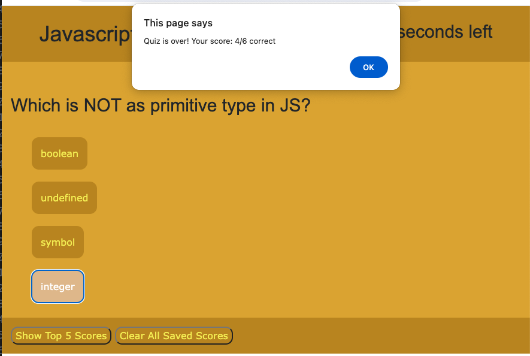

# mod-4-challenge
CHALLENGE GOAL:

Module 4 challenge is a Code Quiz.
This challenge is to build a timed coding quiz with multiple-choice questions. This app will run in the browser, and will feature dynamically updated HTML and CSS powered by JavaScript.

RESOURCES USED:

*Class instruction and office hours
*Pertinent MDN and W3 sections
*Xpert Learning assistant to help troubleshoot several issues

RELEVANT LINKS:

Repository: https://github.com/TreyLathe/mod-4-challenge
Deployed Site: https://treylathe.github.io/mod-4-challenge/
 
SCREENSHOTS:
Opening page:

Questions presented:

Quiz over, score shown:

Initials requested, save score:

Top 5 scores, sorted, shown:

COMMENTS:

> User Story:
AS A coding boot camp student
I WANT to take a timed quiz on JavaScript fundamentals that stores high scores
SO THAT I can gauge my progress compared to my peers

> The application included in this submission fulfills the following acceptance criteria:

> WHEN I click the start button
THEN a timer starts and I am presented with a question

** WHen start button is clicked, a timer starts (and shown in header) and first question multiple choice answers are presented

> WHEN I answer a question
THEN I am presented with another question

** After answering question, the next question in an array is presented with multiple choice answers. 

> WHEN I answer a question incorrectly
THEN time is subtracted from the clock

**If answer is correct, an alert informs them. If the answer is incorrect, an alert informs them and 10 seconds is subtracted from the timer. 

> WHEN all questions are answered or the timer reaches 0
THEN the game is over

** if timer runs out or when questions are all answered, game is over and user is
shown score. 

> WHEN the game is over
THEN I can save my initials and score

**User is then presented with an input to add intials.
**Once user inputs initials and saves score, quiz page is reloaded so user can retake the quiz 

**Additonally, all scores are saved in local storage and when the "past results" button 
is clicked, top five results are shown sorted by score.
**"Clear Results button removes all past scores from local storage.
